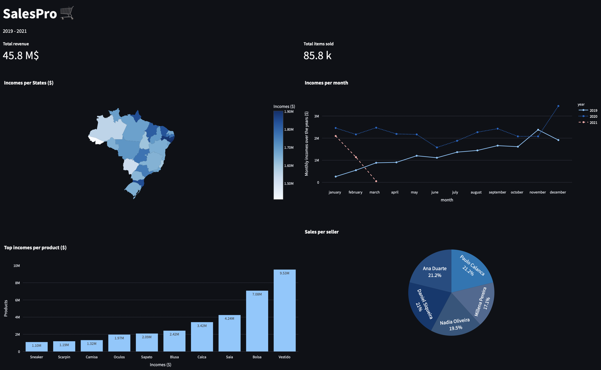

### **Description**  🗒️

SalesPro is an interactive dashboard of an e-commerce deployed on Streamlit. The data source was taken from a GitHub repository, however, the processing of the data was done using python, pandas and PostgreSQL with 
an ETL alongsinde the project.

### **Table of Contents**  📑

- [Content of the repository](#content-of-the-repository)
- [How to Install and Run the Project](#how-to-install-and-run-the-project)
- [How to use the project](#how-to-use-the-project)
- [Contributions](#Contributions)
- [Credits](#credits)
- [Licence](#Licence)

### **Content of the repository**  🔡

1. main.py
2. notebook.ipynb
3. requirements.txt
4. bargraphs.py
5. bargraphsTopCities.py
6. linegraphs.py
7. mapgraphs.py
8. pizzagraph.py
9. README.md
10. License
11. .gigignore
12. fashionShop.jpeg

### **How to Install and Run the Project**  🏃

You must set up an python environment installing the package included in the requirements file (.txt). Then, you can use any Integrated Development Environment (IDE) such as Jupyter or Visual Studio Code to run the
main.py file. Next, you have to run the notebook.ipynb to generate the .csv files.

### **How to use the project**  📂

You need to run the main.py in python using the following command:

streamlit run main.py

### **Contributions**  ✍️

We would like to you to encourage to contribute in any form to the project through this public repository. 

### **Licence**  👮

*MIT* Licence

 
<h3 align="center">🛠️ Members of the team</h3>
 

 
 

|Members|Roles|Network|
|:---:|:---:|:---:|
|**Mirna**|| <a target="_blank" rel="noopener noreferrer" href="https://www.linkedin.com/in/marcelo-peralta2/"> </a> |
|**Edwin Garcia**| |  |
|**Alexangel**|| <a target="_blank" rel="noopener noreferrer" href="https://www.linkedin.com/in/gnavarromarin/"></a> |
|**Richard**|| <a target="_blank" rel="noopener noreferrer" href="https://www.linkedin.com/in/leopoldofloresc/"></a> |
|**Juan Campos**|| <a target="_blank" rel="noopener noreferrer" href="https://www.linkedin.com/in/leopoldofloresc/"></a> |
|**Leopoldo Flores**|| <a target="_blank" rel="noopener noreferrer" href="https://www.linkedin.com/in/leopoldofloresc/"></a> |

 

<h2>🚧 Technology stack </h2>

